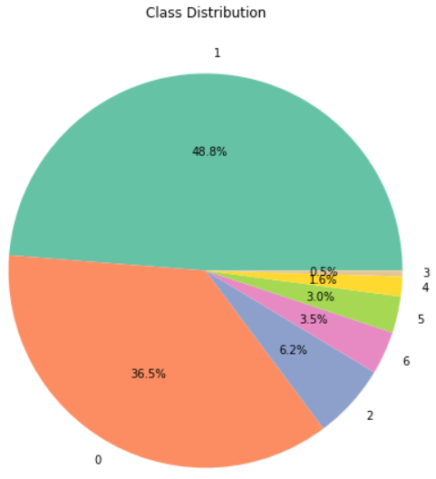
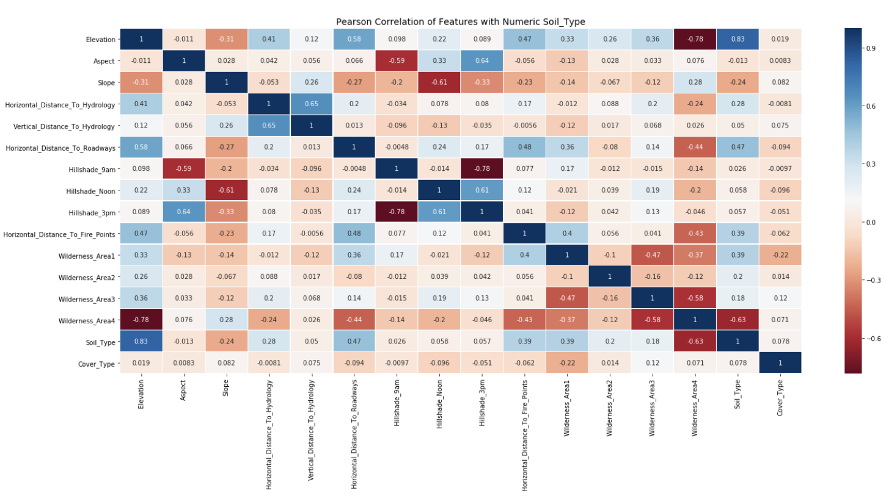
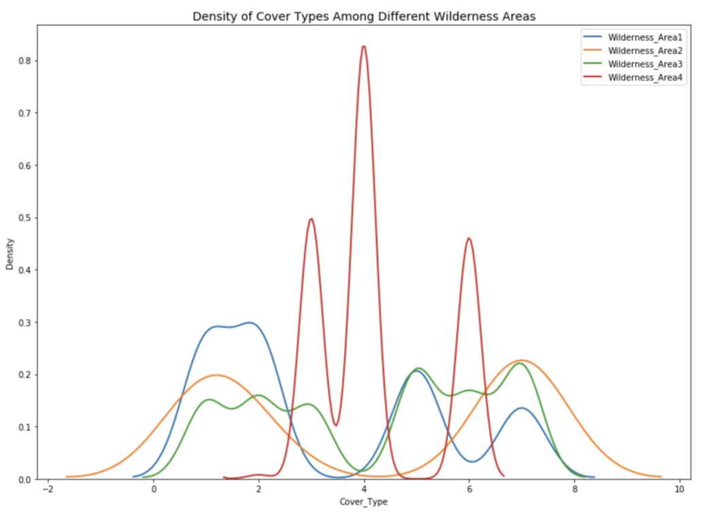
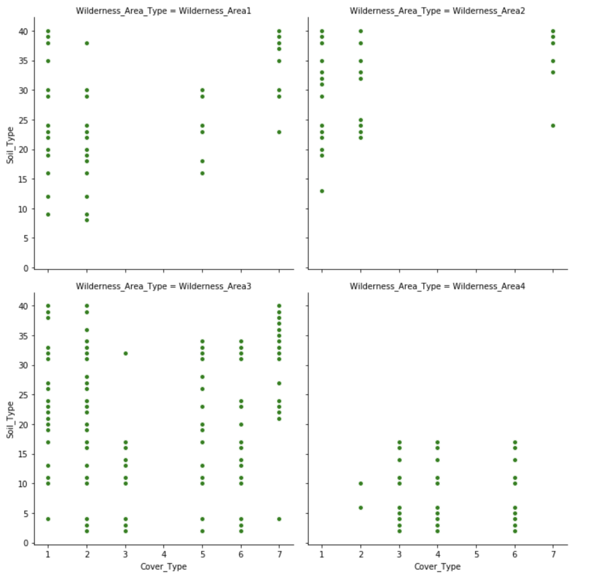

# Forest Cover Type 

## Summary
[- Introduction](#Introduction).\
[- Dataset](#Dataset).\
[- Online-learning](#Online-learning).\
[- Batch-learning](#Batch-learning).

The objective of the project, as part of the IoT Data Analytics exam, is to predict the forest covertype with the sole use of cartographic variables.
To do this, the "Covertype Data Set" dataset was used, available at the following link:
[link](https://archive.ics.uci.edu/ml/datasets/covertype).
The dataset, although static, was used to simulate data streams for training and predictor evaluation. 

# Introduction
The goal of the project was to evaluate the performance of classifiers in classifying real-time data streams. To do this we made use of the Python Scikit-multiflow library which allowed us to use a static dataset contained in a .csv file as a data stream.
Among the classifiers in the library have been selected:
-**OzaBag Classifier**
-**SAM KNN Classifier**
-**Streaming Random Patches Classifier**

After analyzing the results obtained, we used Undersampling and Oversampling techniques to improve performance and then re-run the classifiers by simulating the data stream again.

# Dataset
The dataset used was developed by Colorado State University as part of the "Remote Sensing and GIS Program".
The data refer to 30x30 meters large clods of land in the "Roosevelt National Forest of Northern Colorado" for a total of 581012 tuples.
Each tuple is made up of 54 attributes, which we are now going to list:
- Elevation in meters.
- Aspect in degrees azimuth.
- Slope in degrees.
- Horizontal distance to nearest surface water.
- Vertical distance to nearest surface water.
- Horizontal distance to nearest roadway.
- Hill shade index at 9am, summer solstice.
- Hill shade index at noon, summer solstice.
- Hill shade index at 3am, simmer solstice.
- Horizontal distance to nearest wildfire ignition points.
- Wilderness area designation.
- Soil type designation.
- Forest cover type designation (dependent attribute). The seven cover types, with the respective number of entries, are: 
    - Spruce/Fir.
    - Lodgepole Pine.
    - Ponderosa Pine.
    - Cottonwood/Willow.
    - Aspen.
    - Douglas-fir.
    - Krummholz.

The dataset has various problems that have been analyzed in an attempt to improve the performance of the predictors.
The Cover_Type variable, which is the target value, is distributed as follows:
• Lodgepole Pine: 48.76%

• Spruce/Fir: 36.46%

• Ponderosa Pine: 6.15%

• Krummholz: 3.53%
• Douglas-fir: 2.99%
• Aspen: 1.63%
• Cottonwood/Willow: 0.47%

    

Another problem is highlighted by the Pearson Correlation Coefficient which indicates howmuch a variable influences the result of the prediction:

    

The dark boxes indicate a greater influence of the data, as you can see a particularly dark
area is given by the wilderness_area which greatly affect the result and by the soil_Type. The
wilderness_area are distributed as follows:

    

There is also a strong correlation between the Cover_Type and the combination of the Wilderness_area and the Soil_Type:

    

# Online-learning
**We do not report the results obtained with the various classifiers here. They are insted reported in the main document**. 
The online phase was performed using python's scikit-multiflow library to simulate data flow, to collect performance information, and to run the three selected classifiers:

# Batch-learning
**We do not report the results obtained with the various classifiers here. They are insted reported in the main document.** 
As we have seen previously, the dataset is very unbalanced, during the online phase it is not
possible to apply balancing techniques as the data arrives in the form of data streams, in the batch
phase instead the data are stored statically and it is therefore possible to apply on the balancing
technical datasets such as undersampling and oversampling.

